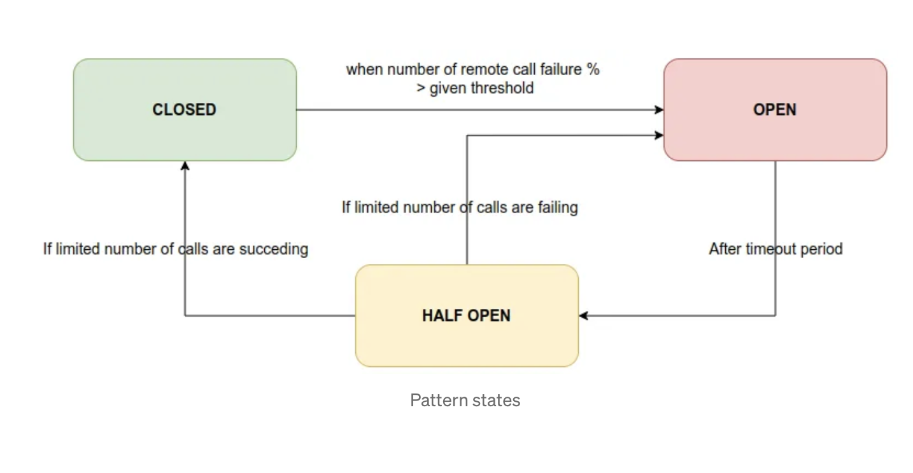
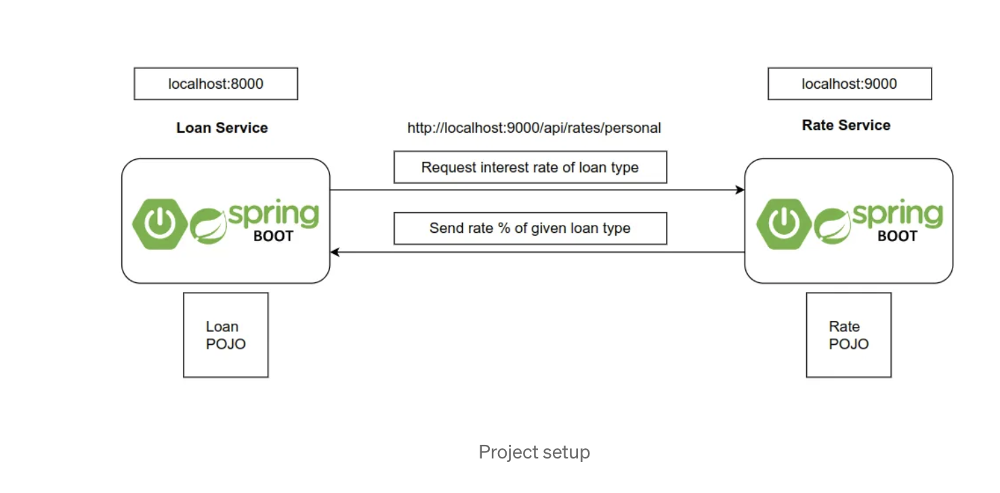

# Circuit Breaker Usage - One service calling another service

<!-- TOC -->
**Overview**: 

- [Requirements](#requirements)
- [What is a circuit breaker pattern](#what-is-a-circuit-breaker-pattern)
- [Step 2: Create an Azure Resource Group ](#step-2-create-an-azure-resource-group)
- [How the pattern works?](#how-the-pattern-works?)
- [Life Cycle of Pattern States](#life-cycle-of-pattern-states)
- [Pattern states](#pattern-states)
- [What is Resilience4j](#what-is-resiliency4j)
- [Create 2 Micro Services ](#create-2-micro-services)
- [Rate Service](#rate-service)
- [Loan Service](#loan-service)

<!-- TOC -->

## Objectives 

Azure Serverless offerings provide a wide array of capabilites to drive modern application architectures with zero-infrastructure and capital investments. This lab demonstrates Azure PaaS offerings including: 

- Azure Event Grid
- Azure Function Apps 
- Azure Cosmos DB 
- Azure infrastructure services to include resource groups, storage accounts and familiarization with Azure CLI services

**NOTE: This exercise is a section of a day-long presentation on Azure App Innovation, the complete workshop may be found [here](https://aka.ms/azuredevdaylabs).**

## Requirements

This example assumes the user already has an Azure subscription with contributor access. Additionally, the following services will be required during the lab: 

- Azure CLI, [How to install Azure CLI](https://docs.microsoft.com/en-us/cli/azure/install-azure-cli)
- Git Bash, [Git Download for Windows](https://gitforwindows.org/)

## Step 1: Setup Azure subscription and make sure you can  sign in 

Initial login and subscription setup is a required prerequisite


NOTE: The region location of the Resource Group may be different than the Azure resources 

## Step 2: Create an Azure Resource Group 

  Navigate to the **Resource Groups** from the top main search bar. Select **Create** to create a New Resource Group
  
  Fill all paramters as shown:
  
- Subscription: **your-subscription-name**
- Resource Name: **devdayfeb-rsg** 
- Region: **East US** 


Click on **Review + create** and then confirm final creation

 
 
  


Micro services are the most important implementation aspect used in the industry now. With the use of micro service architecture, developers could eliminate so many issues they had previously with monolithic applications. Moving forward, people started to search and adopt various patterns into the micro services. Most of the times, new pattern was originated to address a common issue seen in another pattern. In this way, a lot of patterns came into the practice with evolution of time. You can get a whole summary from here: https://microservices.io/patterns/microservices.html

These micro service patterns were further broken down into several categories, considering their scopes. Among all these patterns, there are some very important and popular patterns used by so many developers. Circuit Breaker is one of them which helps to manage downstream service failures in a proper manner. Let’s understand what this pattern does. 💪

## What is Circuit Breaker Pattern?
You may have already heard of circuit breakers we find in electronic items. What is the main purpose of it? Simply, break the electric flow in an unexpected scenario. Same as that, here also this micro service pattern has go the name due to the same nature it has.

This pattern comes into the picture while communicating between services. Let’s take a simple scenario. Let’s say we have two services: Service A and B. Service A is calling Service B(API call) to get some information needed. When Service A is calling to Service B, if Service B is down due to some infrastructure outage, what will happen? Service A is not getting a result and it will be hang by throwing an exception. Then another request comes and it also faces the same situation. Like this request threads will be blocked/hanged until Service B is coming up! As a result, the network resources will be exhausted with low performance and bad user experience. Cascading failures also can happen due to this.

In such scenarios, we can use this Circuit Breaker pattern to solve the problem. It is giving us a way to handle the situation without bothering the end user or application resources.

## How the pattern works? 💥
Basically, it will behave same as an electrical circuit breaker. When the application gets remote service call failures more than a given threshold circuit breaker trips for a particular time period. After this timeout expires, the circuit breaker allows a limited number of requests to go through it. If those requests are getting succeeded, then circuit breaker will be closed and normal operations are resumed. Otherwise, it they are failing, timeout period starts again and do the rest as previous.

Let’s figure out this using the upcoming example scenario that I’m going to explain. 😎

## Life Cycle of Pattern States 💥
There are 3 main states discussed in Circuit Breaker pattern. They are:

CLOSED
OPEN
HALF OPEN
Let’s understand the states briefly….

CLOSED State
When both services which are interacting are up and running, circuit breaker is CLOSED. Circuit breaker is counting the number of remote API calls continuously.

OPEN State
As soon as the percentage of failing remote API calls is exceeding the given threshold, circuit breaker changes its state to OPEN state. Calling micro service will fail immediately, and an exception will be returned. That means, the flow is interrupted.

HALF OPEN State
After staying at OPEN state for a given timeout period, breaker automatically turns its state into HALF OPEN state. In this state, only a LIMITED number of remote API calls are allowed to pass through. If the failing calls count is greater than this limited number, breaker turns again into OPEN state. Otherwise it is CLOSED.



## Pattern states
To demonstrate the pattern practically, I will use Spring Boot framework to create the micro services. Resilience4j library is used to implement the circuit breaker.

## What is Resilience4j?
Resilience4j is a lightweight, easy-to-use fault tolerance library inspired by
Netflix Hystrix. It provides various features.

Circuit Breaker — fault tolerance
Rate Limiter — block too many requests
Time Limiter — limit time while calling remote operations
Retry Mechanism — automatic retry for failed operations
Bulkhead — limit number of concurrent requests
Cache — store results of costly remote operations
We are going to use the very first feature with Spring Boot in this article. 😎

Let’s start!!

## Create 2️⃣ Micro Services
I’m going to implement a simple inter service communication scenario using two services called loan-service and rate-service.

Technical details:
Spring Boot with H2 in-memory DB, JPA, Hibernate, Actuator, Resilience4j

Scenario:
Loan service can fetch Loans saved in DB and each loan object has loan type. There are separate interest rate percentages according to the loan type. So, Rate service is having those Rate object details with it’s name.


Then I have to calculate the total interest value for the loans depending on their loan type.

Then I will update all the Loan objects with the interest amount using the rate I got from Rate service.

I will make a call to Rate service from Loan service requesting the interest rate of the given loan type.



## Rate Service

Create a new Spring Boot project with the dependencies provided inside below POM file. I have named it as rate-service.
Controller:


````shell

@RestController
@RequestMapping("api")
public class RateController {

    @Autowired
    private RateService rateService;

    @GetMapping(path = "/rates/{type}")
    public ResponseEntity<Rate> getRateByType(@PathVariable("type") String type) {
        return ResponseEntity.ok().body(rateService.getRateByType(type));
    }
}

````


Service:


````shell

@Service
public class RateService {

    @Autowired
    private RateRepository repository;

    public Rate getRateByType(String type) {
        return repository.findByType(type).orElseThrow(() -> new RuntimeException("Rate Not Found: " + type));
    }
}

````

Repository:


````shell

@Repository
public interface RateRepository extends JpaRepository<Rate, Integer> {
    Optional<Rate> findByType(String type);
}

````


Entity:


````shell

@Builder
@Getter
@Setter
@AllArgsConstructor
@NoArgsConstructor
@Entity
@Table(name = "rates")
public class Rate {
    @Id
    @GeneratedValue(strategy = GenerationType.IDENTITY)
    Integer id;
    String type;
    @Column(name = "rate")
    Double rateValue;
}

````

Config:


````shell

server:
  port: 9000
spring:
  application:
    name: rate-service
  datasource:
    url: jdbc:h2:mem:cb-rate-db
    username: root
    password: 123
    driverClassName: org.h2.Driver
  jpa:
    database-platform: org.hibernate.dialect.H2Dialect
    hibernate:
      ddl-auto: create-drop
  h2:
    console:
      enabled: true


````


Entry Point: Main class will add 2 types of loan rates when service is coming up.


````shell

@SpringBootApplication
public class RateServiceApplication {

   @Autowired
   private RateRepository rateRepository;

   public static void main(String[] args) {
      SpringApplication.run(RateServiceApplication.class, args);
   }

   @PostConstruct
   public void setupData() {
      rateRepository.saveAll(Arrays.asList(
         Rate.builder().id(1).type("PERSONAL").rateValue(10.0).build(),
         Rate.builder().id(2).type("HOUSING").rateValue(8.0).build()
      ));
   }
}


````


Now we can start rate-service and see check the API we need. Go to http://localhost:9000/api/rates/PERSONAL and see the result. You should get this response.

{"id": 1,"type": "PERSONAL","rateValue": 10}


## Loan Service

Now I need to implement loan-service. The circuit breaker is needed inside loan-service since it’s calling to rate-service. Therefore, Resilience4j library is needed. And I need to check the status of the breaker. For that, I need Actuator enabled in the loan-service.

Create a new Spring Boot project with the dependencies provided inside below POM file. I have named it as loan-service.


Let’s add basic functionalities for the loan-service.


````shell

@RestController
@RequestMapping("api")
public class LoanController {

    @Autowired
    private LoanService loanService;

    @GetMapping(path = "/loans")
    public ResponseEntity<List<Loan>> getLoansByType(@RequestParam("type") String type) {
        return ResponseEntity.ok().body(loanService.getAllLoansByType(type.toUpperCase()));
    }

}

````


Service:
This is the most important place where we perform the remote call. We need to call this API using RestTemplate: http://localhost:9000/api/rates/{type} in rate service to get the % of the loan type. Then we calculate the interest amount as loan amount * (rate/100) and update loan interest amount.


````shell

@Service
public class LoanService {
    @Autowired
    private LoanRepository loanRepository;
    @Autowired
    private RestTemplate restTemplate;
    private static final String SERVICE_NAME = "loan-service";
    private static final String RATE_SERVICE_URL = "http://localhost:9000/api/rates/";
    public List<Loan> getAllLoansByType(String type) {
        HttpHeaders headers = new HttpHeaders();
        headers.setContentType(MediaType.APPLICATION_JSON);
        HttpEntity<InterestRate> entity = new HttpEntity<>(null, headers);
        ResponseEntity<InterestRate> response = restTemplate.exchange(
            (RATE_SERVICE_URL + type),
            HttpMethod.GET, entity,
            InterestRate.class
        );
        InterestRate rate = response.getBody();
        List<Loan> loanList = new ArrayList<>();
        if (rate != null) {
            loanList = loanRepository.findByType(type);
            for (Loan loan : loanList) {
                loan.setInterest(loan.getAmount() * (rate.getRateValue() / 100));
            }
        }
        return loanList;
    }
}


````

Repository:


````shell

public interface LoanRepository extends JpaRepository<Loan, Integer> {
    List<Loan> findByType(String type);
}


````


DTO: This is used to convert the response coming from rate-service API call. Since it’s in the type of Rate. Same as rate-service Rate entity class(only omitted the ORM related things)


````shell


@Data
@AllArgsConstructor
@NoArgsConstructor
public class InterestRate {
    Integer id;
    String type;
    Double rateValue;
}

````

Entity:

````shell


@Builder
@Getter
@Setter
@AllArgsConstructor
@NoArgsConstructor
@Entity
@Table(name = "loans")
public class Loan {
    @Id
    @GeneratedValue(strategy = GenerationType.IDENTITY)
    Integer id;
    String type;
    Double amount;
    Double interest;
}

````

Configuration:


````shell


server:
  port: 8000
spring:
  application:
    name: loan-service
  datasource:
    url: jdbc:h2:mem:cb-loan-db
    username: root
    password: 123
    driverClassName: org.h2.Driver
  jpa:
    database-platform: org.hibernate.dialect.H2Dialect
    hibernate:
      ddl-auto: create-drop
  h2:
    console:
      enabled: true
management:
  endpoint:
    health:
      show-details: always
  endpoints:
    web:
      exposure:
        include: health
  health:
    circuitbreakers:
      enabled: true

````


Entry Point:
Main class will add 3 loan objects when service is coming up. Interest amount has been set as zero since we later update it with the remote call to rate-service.
We need a Bean of RestTemplate class to perform a remote API call. 


````shell


@SpringBootApplication
public class LoanServiceApplication {

   @Autowired
   private LoanRepository loanRepository;

   public static void main(String[] args) {
      SpringApplication.run(LoanServiceApplication.class, args);
   }

   @Bean
   public RestTemplate restTemplate() {
      return new RestTemplate();
   }

   @PostConstruct
   public void setupData() {
      loanRepository.saveAll(Arrays.asList(
         Loan.builder().id(1).type("PERSONAL").amount(200000.0).interest(0.0).build(),
         Loan.builder().id(2).type("HOUSING").amount(6000000.0).interest(0.0).build(),
         Loan.builder().id(3).type("PERSONAL").amount(100000.0).interest(0.0).build()
      ));
   }
}


````


🔴 I have only allowed actuator to display circuit breaker details. Later we will add the circuit breaker configuration here. For now, it’s not needed.

Now we can start rate-service and see check the API we need. Go to http://localhost:8000/api/loans?type=personal and see the result. You should get this response.

[
{"id": 1,"type": "PERSONAL","amount": 200000,"interest": 20000},    {"id": 3,"type": "PERSONAL","amount": 100000,"interest": 10000}
]
Enable Circuit Breaker with fallback method 💥
Now we have to enrich our Loan service method with an annotation. It is called “@CircuitBreaker”. Here, SERVICE_NAME is taken as “loan-service”. Then we have to provide a fallbackMethod. The purpose of that is to call it by default when the downstream service(rate-service) is failing to respond.


````shell

@CircuitBreaker(name = SERVICE_NAME, fallbackMethod = "getDefaultLoans")
public List<Loan> getAllLoansByType(String type) {
         ...............
}


````

I have setup the method to return an empty List by default when rate service is not responding.

🔴 You can setup this method to show an error message also without sending an empty message. You can return something like this — “Rate service is not responding. Request failed!”. Sending empty array or a default set of data is not the ideal way. Because it will make a confusion to the users. But you MUST make sure that both methods are returning the same type of data. In my case: both methods are returning Lists!


````shell

public List<Loan> getDefaultLoans(Exception e) {
    return new ArrayList<>();
}


````

Add Circuit Breaker Configs 💥
Let’s add Resilience4j circuit breaker configurations. Add this to application.yml in loan-service.


````shell

resilience4j:
  circuitbreaker:
    instances:
      loan-service:
        registerHealthIndicator: true
        failureRateThreshold: 50
        minimumNumberOfCalls: 5
        automaticTransitionFromOpenToHalfOpenEnabled: true
        waitDurationInOpenState: 5s
        permittedNumberOfCallsInHalfOpenState: 3
        slidingWindowSize: 10
        slidingWindowType: COUNT_BASED
failureRateThreshold—Expected percentage of the failure threshold.


````


I have set it as 50%. It means, when total failed remote calls % is equal or greater than 50%, breaker will be active to stop furthermore requests.
minimumNumberOfCalls — Minimum number of total API calls to decide failure percentage to enable the breaker.
I have set it as 5. Let’s say 3 API calls are failing from the the first 5 API calls. It means failureRateThreshold = (3/5) * 100 = 60%.
automaticTransitionFromOpenToHalfOpenEnabled — I have set this as true. It will automatically transfer OPEN state to HALF OPEN state when it comes the right time for that transition.
waitDurationInOpenState — Timeout period before going to HALF OPEN state from OPEN state. After 5 seconds, breaker will change the state, here.
permittedNumberOfCallsInHalfOpenState — Number of LIMITED API calls that should be sent while in HALF OPEN state. I have set it as 3. So, after 3 API calls, if they are failed, then breaker will again go to OPEN state. Otherwise breaker will be CLOSED since rate-service is UP.
slidingWindowType: Here I have set the type to keep the circuit breaker behavior based on the requests counts.
Start both services. Now go to loan service actuator URL and see how circuit breaker is shown there: http://localhost:8000/actuator/health. Circuit breaker details has been highlighted in the response.


````shell


{
  "status": "UP",
  "components": {
    "circuitBreakers": {
      "status": "UP",
      "details": {
        "loan-service": {
          "status": "UP",
          "details": {
            "failureRate": "-1.0%",
            "failureRateThreshold": "50.0%",
            "slowCallRate": "-1.0%",
            "slowCallRateThreshold": "100.0%",
            "bufferedCalls": 1,
            "slowCalls": 0,
            "slowFailedCalls": 0,
            "failedCalls": 0,
            "notPermittedCalls": 0,
            "state": "CLOSED"
          }
        }
      }
    },
   ......................................
  }
}


````

bufferedCalls —Total API calls from loan-service to rate-service
failedCalls — Total count of failed API calls from loan-service to rate-service
failureRate — (failedCalls/bufferedCalls) * 100%
Test Circuit Breaker 💥
We have to follow some ordered steps to see the changes exactly. In each step, we have to see the actuator endpoint and see how circuit breaker is behaving by changing its state. Let’s start!!! 💪

Start both micro services. Loan service is running on 8000 and Rate service is running on 9000. Am i right???
Now hit this API 2 times: http://localhost:8000/api/loans?type=personal. Then go and check the actuator: http://localhost:8000/actuator/health. Now bufferedCalls count has been updated into 2 as expected. Still breaker is CLOSED since rate service is UP.


````shell


{
    "loan-service": {
        "status": "UP",
        "details": {
            "failureRate": "-1.0%",
            "failureRateThreshold": "50.0%",
            "slowCallRate": "-1.0%",
            "slowCallRateThreshold": "100.0%",
            "bufferedCalls": 2,
            "slowCalls": 0,
            "slowFailedCalls": 0,
            "failedCalls": 0,
            "notPermittedCalls": 0,
            "state": "CLOSED"
        }
    }
}


````


Now STOP the rate-service!! Then hit loan service API URL 3 times: http://localhost:8000/api/loans?type=personal. You should get an empty array we setup as fallback! This will lead bufferedCalls count to 5(Previous 2 and this 3). Right? At the same time, failedCalls count is updated into 3. Right?? Now failureRate becomes 60%( (3/5) * 100% ). Then it has exceeded our threshold: 50%. 😅 Then the circuit breaker changes its state to OPEN! 😍


````shell

{
    "loan-service": {
        "status": "CIRCUIT_OPEN",
        "details": {
            "failureRate": "60.0%",
            "failureRateThreshold": "50.0%",
            "slowCallRate": "0.0%",
            "slowCallRateThreshold": "100.0%",
            "bufferedCalls": 5,
            "slowCalls": 0,
            "slowFailedCalls": 0,
            "failedCalls": 3,
            "notPermittedCalls": 0,
            "state": "OPEN"
        }
    }
}

````


Then wait for 5 seconds. It should then convert into HALF OPEN state after 5 seconds right? According to our configurations we have set waitDurationInOpenState to 5s…This is the timeout period…After this time period, request counts also will be reset.


````shell

{
    "loan-service": {
        "status": "CIRCUIT_HALF_OPEN",
        "details": {
            "failureRate": "-1.0%",
            "failureRateThreshold": "50.0%",
            "slowCallRate": "-1.0%",
            "slowCallRateThreshold": "100.0%",
            "bufferedCalls": 0,
            "slowCalls": 0,
            "slowFailedCalls": 0,
            "failedCalls": 0,
            "notPermittedCalls": 0,
            "state": "HALF_OPEN"
        }
    }
}

````


Within HALF OPEN state, limited number of requests will be allowed to pass. In our case it is 3 in the configs the relevant value has been set as permittedNumberOfCallsInHalfOpenState: 3.
Since still rate-service is down, just try loan-service API 3 times again! http://localhost:8000/api/loans?type=personal…What happened? All 3 calls failed! Then failureRate is 100%. Again our circuit breaker will be opened.


````shell

{
    "loan-service": {
        "status": "CIRCUIT_OPEN",
        "details": {
            "failureRate": "100.0%",
            "failureRateThreshold": "50.0%",
            "slowCallRate": "0.0%",
            "slowCallRateThreshold": "100.0%",
            "bufferedCalls": 3,
            "slowCalls": 0,
            "slowFailedCalls": 0,
            "failedCalls": 3,
            "notPermittedCalls": 0,
            "state": "OPEN"
        }
    }
}

````


After 5 seconds of timeout, again it will become HALF OPEN! Check again using actuator. You should be getting an empty array for loan service API call still…
Now start the rate-service!!! 😎 Then try this API 3 times again: http://localhost:8000/api/loans?type=personal..What happened? You should get the actual result now! And what about the actuator results? See…Now circuit breaker is CLOSED! 😍 Because expected limited API calls count is successfully executed.


````shell

{
    "loan-service": {
        "status": "UP",
        "details": {
            "failureRate": "-1.0%",
            "failureRateThreshold": "50.0%",
            "slowCallRate": "-1.0%",
            "slowCallRateThreshold": "100.0%",
            "bufferedCalls": 0,
            "slowCalls": 0,
            "slowFailedCalls": 0,
            "failedCalls": 0,
            "notPermittedCalls": 0,
            "state": "CLOSED"
        }
    }
}


````


Now we practically saw how breaker is behaving right? Isn’t amazing?? 😎 It is working as expected guys!!!


